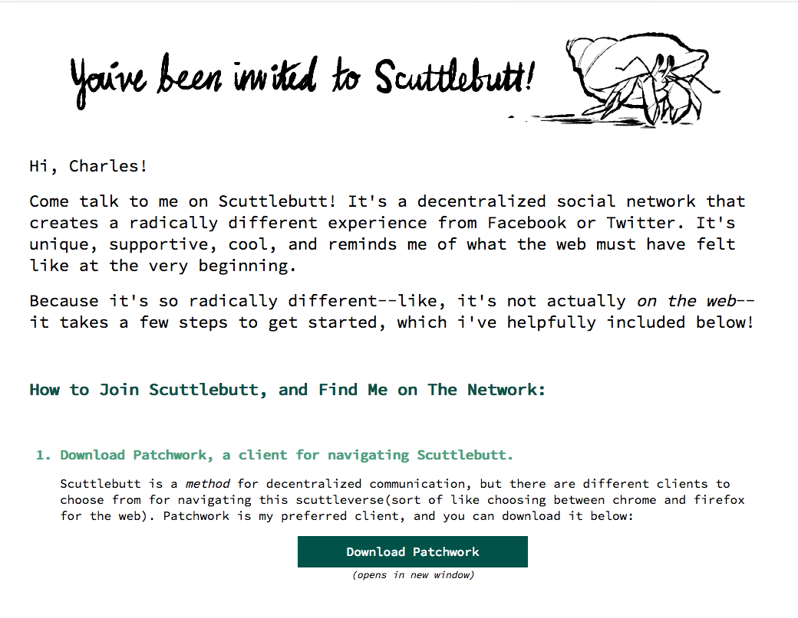
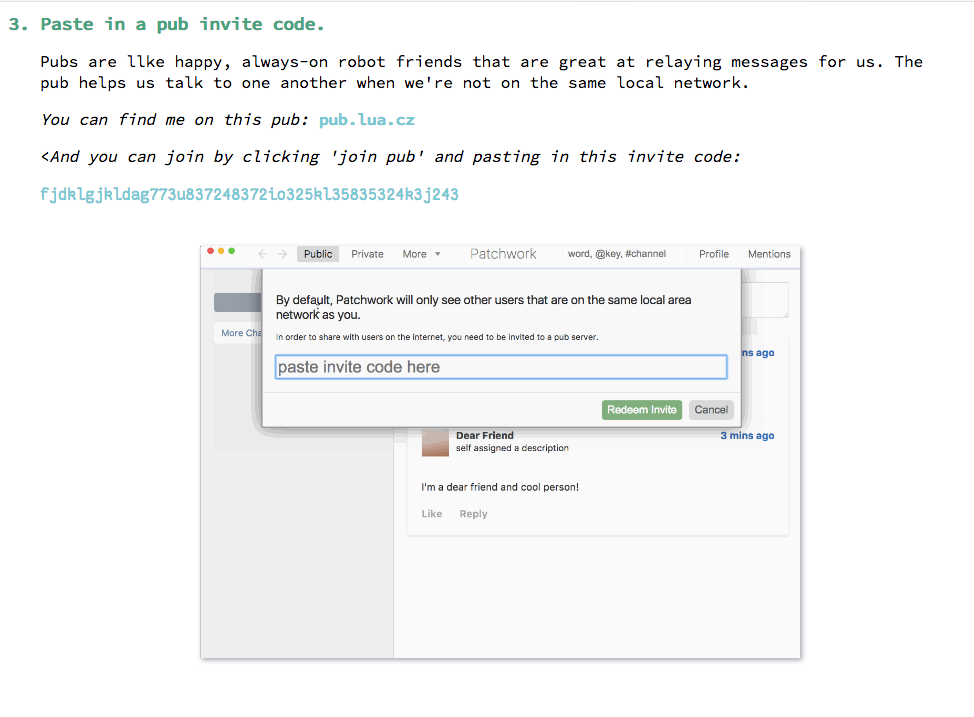

## Onboarding Link Generator

**A command line tool to create personalized patchwork invite pages for your friends!**

# Background

I want Scuttlebutt to grow intentionally, and a great way to do that is word of mouth with our
friends. It can be difficult to have friends join _and_ find you in the vast scuttleverse, though,
unless you are onboarding them in person on the same local network. 

What would be great is a personalized invite site you can send as a link to your friend, that
includes all the steps needed to get onboard and connected to a pub you frequent. And because we
value individual autonomy and diversity, it'd be _especially_ cool if you could host that invite
link wherever you'd like.  That is where this tool comes in!


# Summary of Use

The onboarding link generator lets you create a static page for each of the friends you want to
invite.  This page includes steps on installing patchwork, the pub you would like them to join, an
invite code for this pub, and other good details for them to confidently join the 'verse.

Each page follows a set and styled template, which includes handy GIFS for each of the major steps,
and so you do not need to style the page, just personalize it.

You create these pages by invoking the generator within the command line, and answering the
questions it presents.  When you move through the whole process, a new directory is made on your
computer, named after your friend.  This directory includes two files, an index.html file and
a stylesheet.css file.  Both are already filled out, and so you simply move this folder to where you
host your site, and now have a handy link to give your friend: mysite.com/friends-name/

``` 
Insider Tip: At the bottom of this repo  is a link to a video showing how to use the tool and host a site on
hashbase
```

# Screen Shots 

**The Command Line Tooli** !
[the command line tool](resources/tool-walkthrough.gif) 

**The Generated Invite Page** 




# Usage

``` 
The Tool Requires Python 3
```

**Clone this Repo to your Computer** 
```
git clone ssb://%XpYR3HjkbEL40CQhuGpgZ5P55zGJ1p9aI1L1A3jfVag=.sha256 onboarding-link-generator
``` 

**Navigate to the repo's directory** 
``` 
cd onboarding-link-generator 
``` 

There are two important areas within this directory: onboarding-tool.py and invites/.  You'll invoke the generation through onboarding-tool.py and your finished site will live within the invites/ subdirectory.

**Invoke the Generator**
```
python3 onboarding-tool.py
```
**Run through the Questions**
These are pretty straightforward.  You will want to make sure you invite them to a pub you are following, and invite them with an active pub invite link.  This can be given to you by the pub owner (which may be you!) through whichever process they prefer.  For the final channels, you can write the channel plus a description of it, if you wanna get fancy.

**Find, then move, your new site**
When the tool is done you'll have a new directory within invites called 'friends-name'.  This has the index.html file and the stylesheet.  Simply move this entire directory to wherever you host your site.  Below is a link to a video showing how to do this using hashbase.

**Save Time in the Future with the 'contact-info.ini' file**
In the root directory of the repo is a file called 'contact-info.ini'.  This has three sections you can fill out with your own details.  Then, these details are automatically filled out in the questions.  It's useful so you don't have to type in yr pub key each time.  Fill in each one with whatever you like (or leave it blank if you wanna type it anew each time) but please don't remove any of the contacts.

**[How to Easily Host Invite Pages on Hashbase: A Video!](https://vimeo.com/243558425)**

